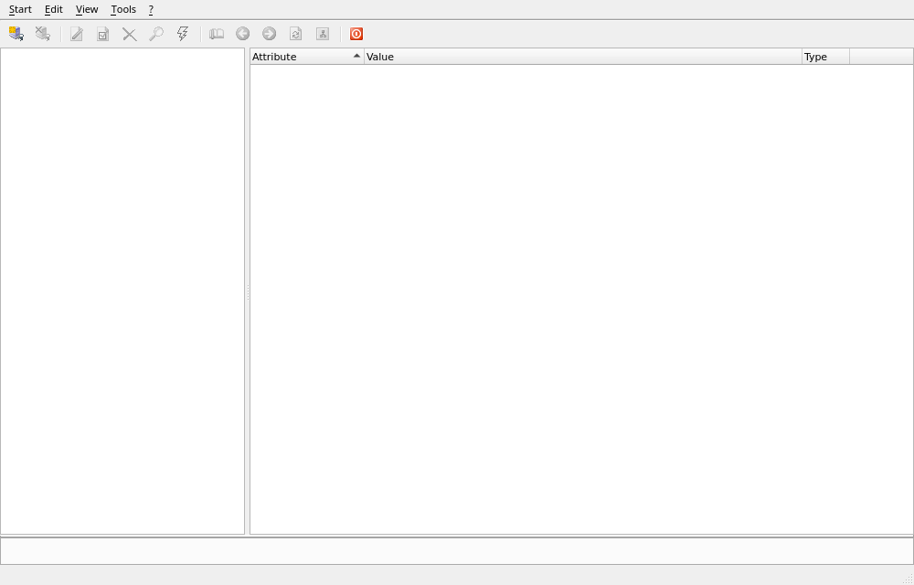
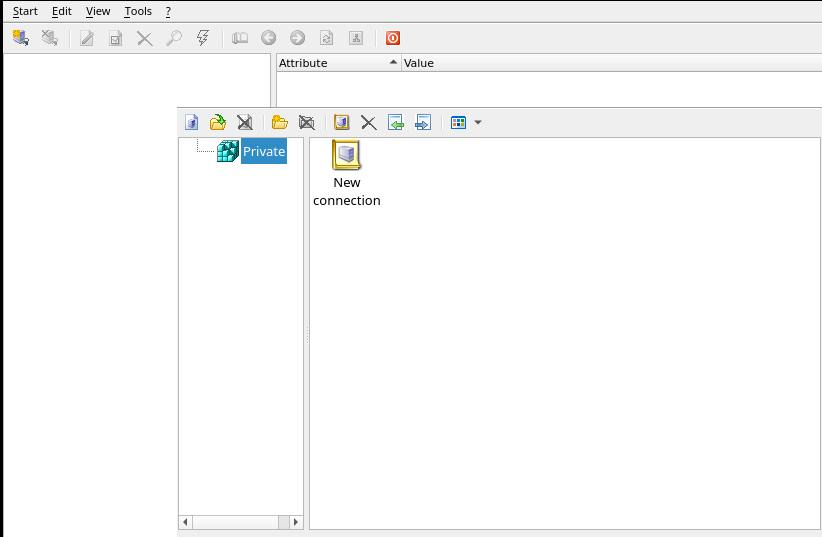

# LDAP Admin for Linux

[](https://github.com/mikhailartamonov/LDAP-Admin/actions/workflows/build.yml)
[](https://github.com/mikhailartamonov/LDAP-Admin/releases/latest)
[](https://github.com/mikhailartamonov/LDAP-Admin/releases)


**A no-nonsense LDAP directory client for Linux — packaged so it just installs.**

> For about ten years I kept waiting for programmers to finally ship a
> reasonably usable LDAP client for Linux. As usual, they never got around to
> it — so I picked up what already existed and finished the job myself.
>
> If you've also given up waiting on developers for a tool that never came —
> and something about mine doesn't work for you — open an issue. We're
> engineers; we'll dig in together and figure out where the problem really
> comes from. Don't be shy, colleagues — drop a line.
>
> Not a GitHub person? If it's a substantive question and I've gone quiet on
> here, reach me on Telegram ([@DevOps0017](https://t.me/DevOps0017)) or by
> email (mailtoartamonov@gmail.com). I'll be genuinely amazed someone did — but
> I'll take it in good faith and try to patch whatever's wrong.

A maintained Linux fork of [LDAP Admin](http://ldapadmin.org) — a client and
administration tool for LDAP directories (OpenLDAP, Samba AD). This fork exists
to provide **ready-to-install packages** so you don't have to install Lazarus
and compile anything by hand.

To be clear: I didn't write this from scratch. I stood on other people's
work — the original Windows application, the community Linux port, and a decade
of bug reports filed by users — and did the unglamorous part: fixing what was
broken and turning it into something you can actually install and use. Credit
for the foundation goes to them (see [Credits](#credits)); the blame for the
packaging is mine.

> Tested against **OpenLDAP**. Active Directory / Samba AD *should* work too in
> principle, but I don't run Windows myself, so that path is untested — reports
> from anyone who does are very welcome.

> **Heads-up / disclaimer.** I built and run this on my own machines only:
> Ubuntu 26.04 (kernel `7.0.0-22-generic`) and Arch Linux (rolling). It has
> been tested *only* on my own laptops, so on a different setup your mileage
> may vary. If it breaks for you, open an issue and we'll sort it out.



---

## Install

### One-liner (Ubuntu & Arch)

```sh
curl -fsSL https://raw.githubusercontent.com/mikhailartamonov/LDAP-Admin/master/packaging/install.sh | sh
```

The script detects your distribution, downloads the matching artifact from the
[latest release](../../releases/latest) and installs it (`.deb` via `apt` on
Ubuntu/Debian, `.pkg.tar.zst` via `pacman` on Arch, AppImage everywhere else).

### Ubuntu / Debian (`.deb`)

```sh
# download ldapadmin_<version>_amd64.deb from the Releases page, then:
sudo apt install ./ldapadmin_*_amd64.deb
```

Or add the APT repository (hosted on GitHub Pages) to get updates via `apt`:

```sh
echo "deb [trusted=yes] https://mikhailartamonov.github.io/LDAP-Admin/apt ./" \
  | sudo tee /etc/apt/sources.list.d/ldapadmin.list
sudo apt update && sudo apt install ldapadmin
```

### Arch Linux (`.pkg.tar.zst`)

```sh
# download the package from the Releases page, then:
sudo pacman -U ldapadmin-*-x86_64.pkg.tar.zst
```

Or build it yourself from the bundled [`PKGBUILD`](packaging/PKGBUILD):

```sh
makepkg -si
```

### AppImage (any distro)

```sh
chmod +x LDAP-Admin-*.AppImage
./LDAP-Admin-*.AppImage
```

After installing a package, launch it from your application menu or run
`ldapadmin` from a terminal.

## Features

- Browse and edit LDAP directories
- Recursive operations on directory trees (copy, move, delete)
- Schema browser
- LDIF export / import
- Password management (crypt, md5, sha, sha-crypt, samba)
- Template support
- Binary attribute support
- LDAP over SSL/TLS

## Screenshots

| Main window | Connection manager |
|---|---|
|  |  |

---

## How packages are built

Everything is built on GitHub Actions — see
[`.github/workflows/build.yml`](.github/workflows/build.yml):

| Distro | Toolchain | Widgetset | Output |
|--------|-----------|-----------|--------|
| Ubuntu | official Lazarus 4.6 + FPC 3.2.2 | Qt5 | `.deb`, AppImage |
| Arch   | `lazarus-qt5` + `qt5pas`          | Qt5 | `.pkg.tar.zst` |

The UI uses the **Qt5** widgetset for a modern, native look (rounded window
corners and proper theming on GNOME/KDE). It's built on Qt5 deliberately —
Qt5 is the more stable, battle-tested binding, and I have no patience left to
wait for the programmers to deliver a properly working Qt6 one.

Pushing a `v*` tag triggers a release with all three artifacts attached.

## Build from source

Requirements: Lazarus 4.x, FPC 3.2.2, the mORMot2 submodule and Qt5 bindings
(`libqt5pas-dev` on Debian/Ubuntu, `qt5pas` on Arch).

```sh
git clone https://github.com/mikhailartamonov/LDAP-Admin.git
cd LDAP-Admin
git submodule update --init --recursive
./packaging/build.sh                 # builds Source/LdapAdmin
```

Build the packages from the compiled binary:

```sh
./packaging/build-deb.sh             # -> dist/ldapadmin_<ver>_amd64.deb
./packaging/build-appimage.sh        # -> dist/LDAP-Admin-<ver>-x86_64.AppImage
```

### Compiling in the Lazarus IDE

Open `Source/LdapAdmin.lpi`, make sure the `mormot2` package
(`submodules/mORMot2/packages/lazarus/mormot2.lpk`) is registered, then build.

## Configuration

Connections and settings are stored per-user under
`~/.config/LdapAdmin/`. Default templates live next to the binary in
`/usr/lib/ldapadmin/`.

## Localization

Translations are compiled `.po`/`.mo` files (Russian, German, Polish included).
To add a language, copy `Source/locale/LdapAdmin.po` to
`LdapAdmin.<xx>.po`, translate it with [Poedit](https://poedit.net/) and place
the resulting `.mo` next to the binary in `locale/`.

---

## Credits

- Original Windows application: <http://www.ldapadmin.org>
- Linux port: <https://github.com/ibv/LDAP-Admin>
- mORMot2 framework: <https://github.com/synopse/mORMot2>

Licensed under the **GNU GPL v2**, same as upstream LDAP Admin.
